# Lab 3 - Create and Test Voice Flows for Webex AI Agents

## **Objective**

This lab exercise aims to guide participants in creating and configuring a voice flow for an Autonomous Webex AI Agent that was set up in a previous exercise. Participants will then interact with the AI Agent via a phone call to test the voice flow. 

This exercise will also provide an opportunity to experience the AI Assistant feature of the contact center by highlighting the virtual agent's conversation summary when the call is escalated to a live agent

## **Section 1 - Voice flow configuration**

- Navigate to the Control Hub and log in using the credentials provided above.
- After logging in to the Control Hub, navigate to the **'Flows'** menu on the-left hand side.
- Click **'Manage Flows'** and select **'Create Flows'**.

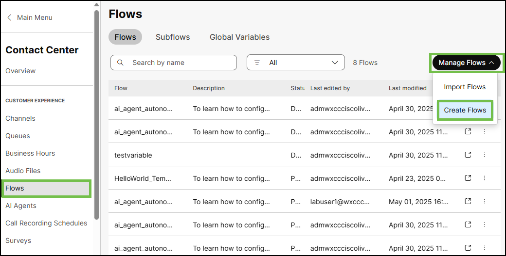{ width="800" }

- In Flow creation setup page choose **'Flow'**, select **'Use a Template'** and click next. 

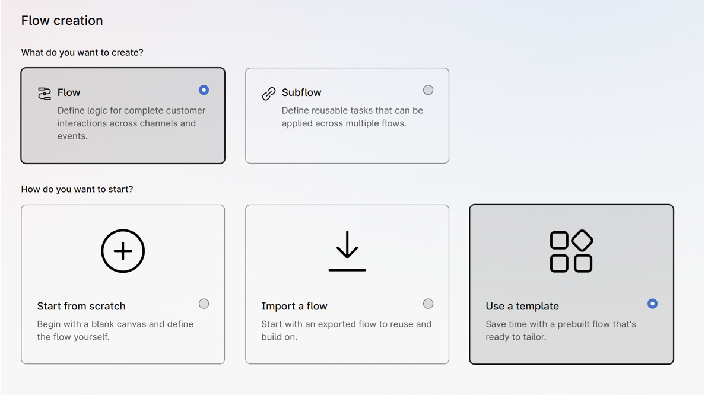{ width="800" }

- Search for **'AI Agent Autonomous (Package Tracking)'**, aelect and click **'Next'**, provide a flow name (e.g., '_ai_agent_autonomous_CiscoLiveAnuj_'), and click **'Create Flow'**.

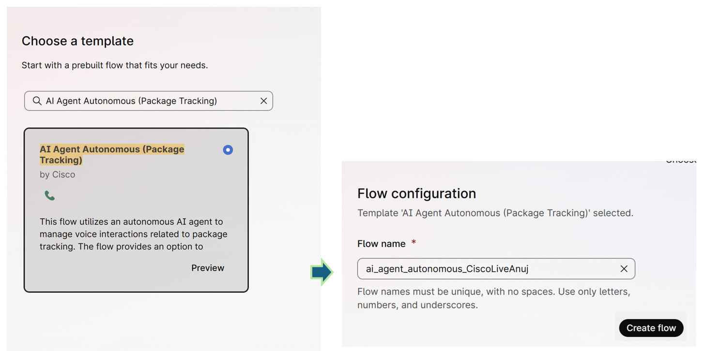{ width="800" }

- Once the flow loads, click on the **'VirtualAgentV2'** node and select the Webex AI Agent (created in **Excercise 1**) under **'Virtual Agent'**.

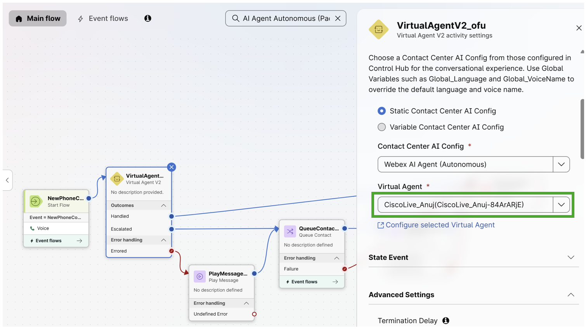{ width="800" }

- Click on the **'QueueContact'** node and select **'CiscoLive_LABCCT1011_Agent_Queue_N'** (where **'N'** is your lab user number).

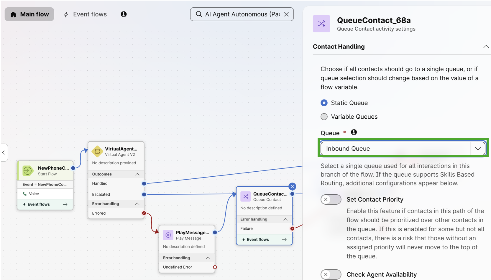{ width="800" }

- Click on an empty space in the flow, then on the right-hand side, navigate to **'Global Variables'**. Click on **'Global_VoiceName'**, select edit option (pencil icon), use **'en-US-Jess'** for **'Default Value'**, and click **'Save'**.

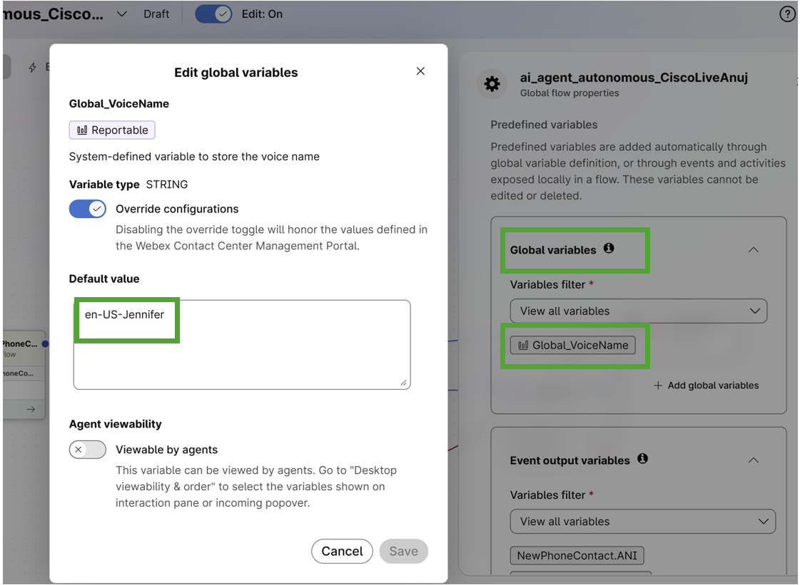{ width="700" }

!!! Note
	    Instead of Jess as the voice, you can choose different voice options like **'en-US-Maria'** and **'en-US-Henry'**. Supported voice languages for AI agents can be checked via <a href="https://help.webex.com/en-us/article/pdef2d/Supported-languages-and-voices-for-AI-agents" target="_blank">Supported Languages and Voices for AI agents.

- Turn Flow Validation **'On'** by clicking the **'Validation'** button at the bottom of the page to publish the flow. Once validation is complete, click **'Publish Flow'** and then **'Publish Flow'** again in the next dialog box (**Latest** version label is selected automatically).

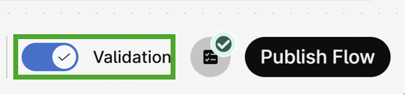{ width="400" }

- Navigate to **'Channels'** menu in the Webex Contact Center configuration.

- Open **CiscoLive_LABCCT1011_EntryPoint_N'** (_where **'N'** is your lab user number)

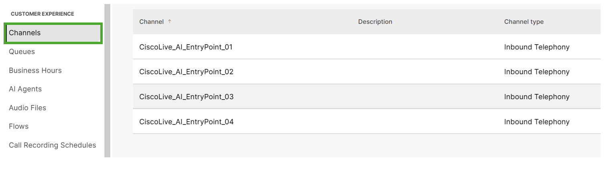{ width="800" }

- Associate your created flow under **'Routing Flow'** and click **save**.  
  
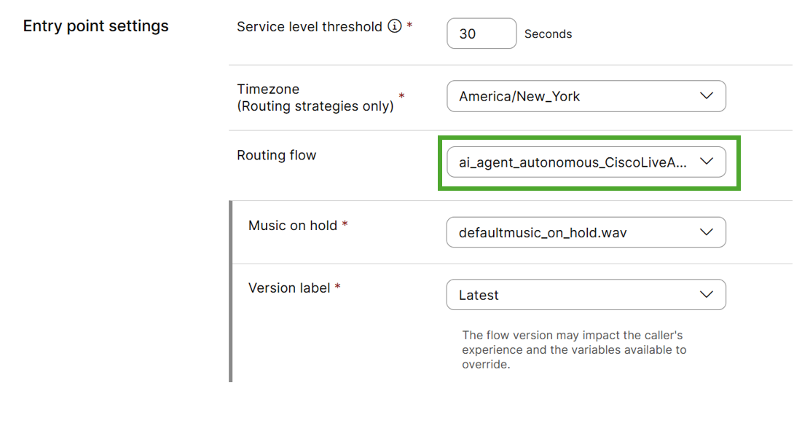{ width="800" }

- Note down the **'Support Number'** associated with this channel - it will be needed later in this lab for testing.

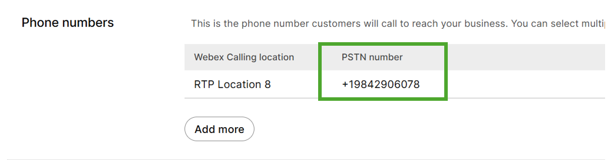{ width="800" }

## **Section 2 - Verifying Voice Flow, Agent Handover and AI Assistant Summary**

- Log in to the Webex Contact Center Agent Desktop.
  
- To access it, go to the main menu in control hub, look under Quick Links, and select **'Desktop'**

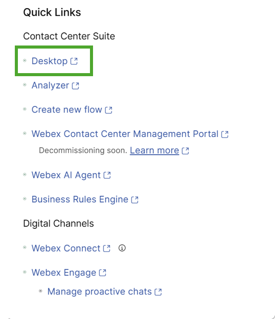{ width="400" }
  
- Under Interaction Preferance select these options:
    - For the team use **CiscoLive_LABCCT1011_Agent_Team_N** (where **'N'** is your lab user number)'.
	- For the Handle Call Using option, select **Dial Number**
 	- For Dial Number use the extension **2032988248** (This is proctor Number)  	

{ width="400" }

-  Ensure the agent status is set to avaialable.

- Call the channel number (from the steps above), interact with the Webex AI Agent and order the car and get the order ID. 

- When you interact with the AI agent, you might notice a couple of issues.

- First, the bot may not be able to answer.

- This could be due to the agent's AI engine. If you notice this issue, you can double check the AI engine is mapped to Webex AI Pro-Us 1.0 in the configured AI Agent Profile and test the call again. 

{ width="700" }

- Second you may notice that the Agent may quickly conclude the call without taking an order or completing the transaction. 

- This is likely related to the termination delay setting, which may be set for too small a window.

- To fix this, follow these steps:

- In the Flow section of the voice flow you created, select the VirtualAgentV2 node.

{ width="600" }

- Under Advanced Settings, you'll see the timeout is set to 15 seconds.

{ width="400" }

- Increase this timeout to 30 seconds and publish the flow.

!!! Note 
		Detailed instructions on how to edit and republish flows have not been provided intentionally, as these steps were performed earlier in the lab.

- Retest the flow by calling in again and place a successfull order.

- You can also instruct the AI agent to escalate the call to a live agent.

- Once the call is transferred, the logged-in agent can answer it and view the full transcript of all previous interactions between the customer and the AI agent within the Agent Desktop.

# Result 
- Congratulations!!! , You have completed this task and the lab!
