# Excercise 1 - Integrate WxCC with MCP Server

## **Objective**

You are an administrator for a business that sells cars online. The business has built an MCP server integrated with its customer car ordering system, and your task is to connect it to Webex Contact Center. Once integrated, customers will be able to chat with an AI agent to check their order status at any time. If they have further questions that the AI agent cannot resolve, they can call in and escalate to a live agent for additional clarification.

The MCP server source code is available on GitHub at the link below. The README file includes instructions on how to deploy it on AWS. You can use this as a reference for implementing the MCP server in your production environment. For this lab, the server is already deployed — the link below is provided for reference only.

<a href="https://github.com/mdanylch/Anuj_MCP_Server" target="_blank">https://github.com/mdanylch/Anuj_MCP_Server</a>

**Prerequisites**

To ensure the WxCC Tenant can be enabled for this feature and that the feature can be used effectively, the following requirements must be adhered to:

- Webex Contact Center tenant with **Flex 3** subscription 
- **A-FLEX-AI-ASST** (The primary AI Assistant add-on SKU)
- **AI Quality Management Bundle** SKU this is Often bundled alongside the base AI Assistant entitlement,
- **Webex Connect** capability on the tenant.

### **MCP Server Integration & Escalation**

You will integrate the MCP server into Webex Contact Center, connecting it to the car ordering system. Once the integration is in place, the AI agent will be able to handle order status queries by pulling live data directly from the ordering system. You will then validate the full experience by testing the end-to-end customer journey — starting from a chat with the AI agent, escalating the call, and finally being connected to a live agent who can continue the conversation.

### **Steps to Configure:**

#### **Step 1: Create Agentic App in Webex Developer Portal.**

- Open the Webex Developer Portal **https://developer.webex.com/** and click Login.

- Sign in with your admin credentials provided in the table. 

    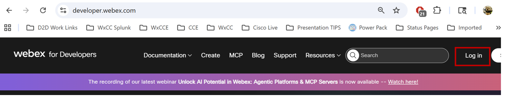{ width="700" }

- Under your profile, click My Webex Apps.

    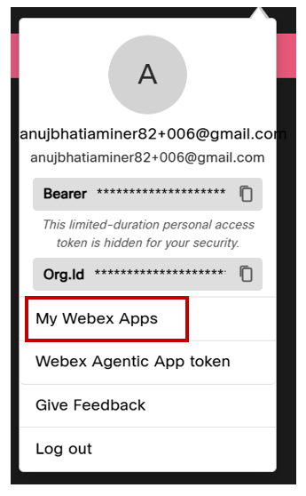{ width="200" }

- Click Create a New App and on the next page, select create an Agentic App.

    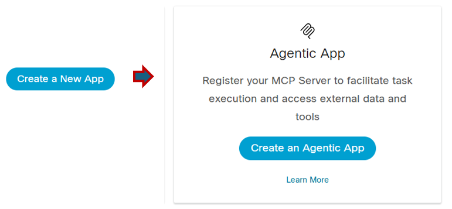{ width="500" }

- For the Agentic App URL, enter
      - **https://bc8esmgmdj.us-east-1.awsapprunner.com/mcp** .

    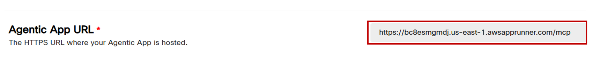{ width="700" }

- Name your app  **Name_MCP_Server**.

    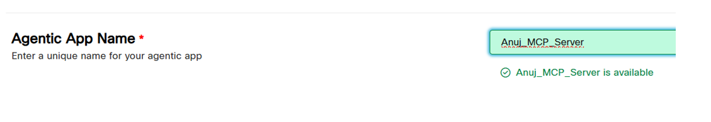{ width="700" }

- For the Agent App Description, paste the following text:

    - **This MCP server is used for the following:**
        - **1) Check the order status based on the order ID.**

    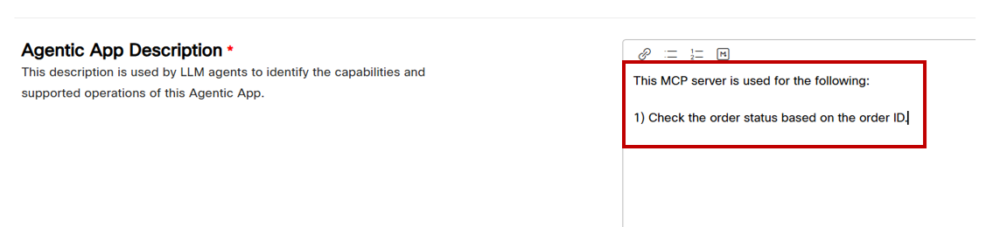{ width="700" }

- Select an available Agentic App Icon by clicking on an icon twice.

- For the Agentic App Auth Type, select Custom Headers.

    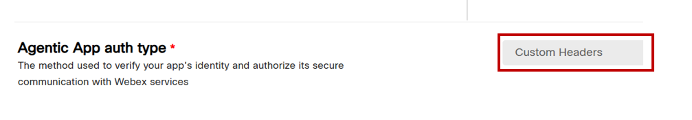{ width="700" }

- Click Add Agentic App to complete the setup.

    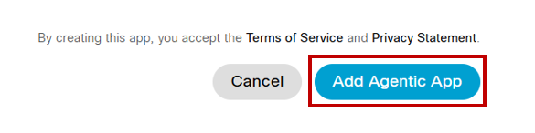{ width="500" }

#### **Step 2: Enable the Agentic App in Control Hub**

- Go to Control Hub at **https://admin.webex.com/**

- Log in with the same admin credentials used on the Developer Portal.

- Navigate to Apps, then click on Agentic Apps.

    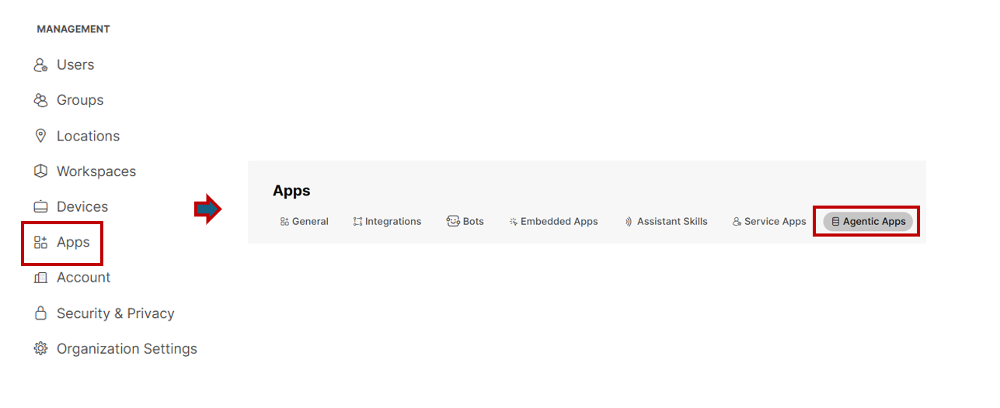{ width="700" }

- In the apps list, find your MCP server associated with your ID — **Name_MCP_Server** and open it.

    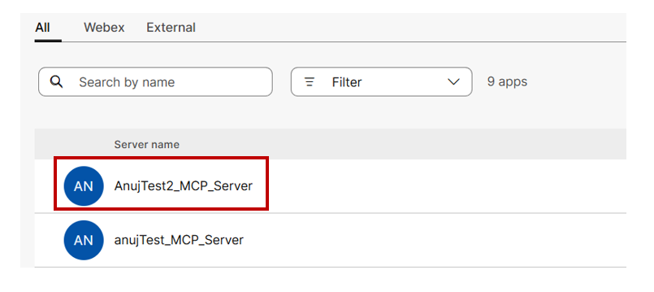{ width="500" }

- In General tab, Set the app to Allowed for All Users, enable Authorize Automatic Server Data Updates, and click Save.

    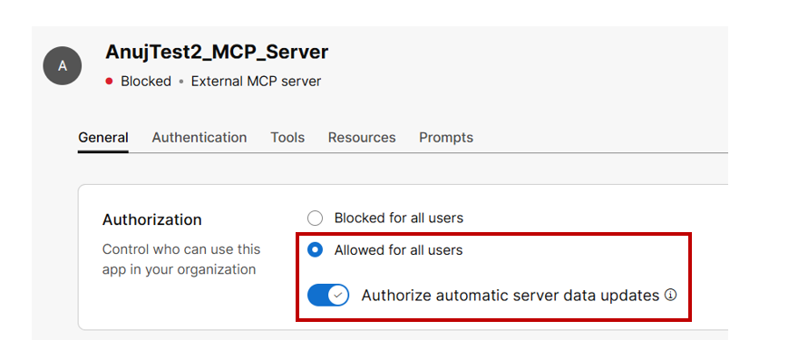{ width="600" }

- Click on Authentication and configure the custom header with the following details, then click Save:

    - **Key**: MCP_REQUEST_HEADERS
    - **Value**: 4f9a2b7e1d8c6b3a0f92e4d5c6b8a1f7

    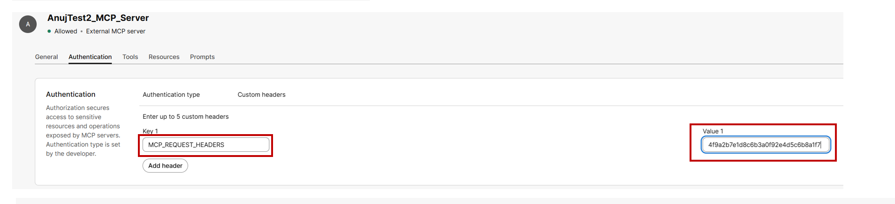{ width="800" }

- Click on Tools, enable check_order_status, allow signature changes, and click Save

    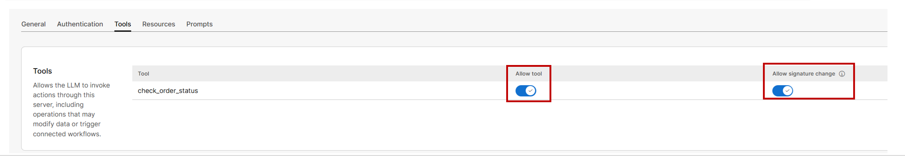{ width="800" }

#### **Step 3: Configure the MCP Server tools with your AI agent**

- To access your AI Agent, navigate to Contct Center and in Quick Links select Webex AI Agent

    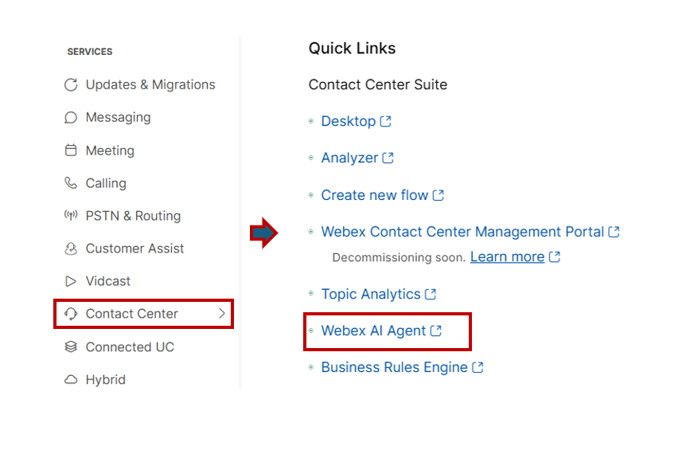{ width="600" }

- Open your AI Agent **CiscoLive_MCPAIAgent_number***. Your instructor will provide you with the specific AI Agent to use.

- Navigate to Actions, and click Add Action, then select Select Available.

    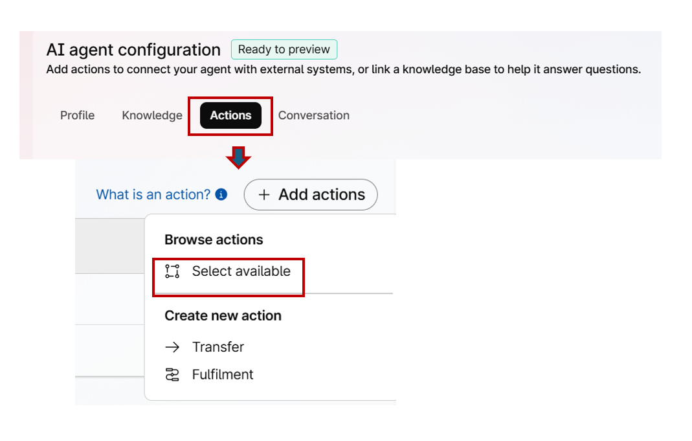{ width="600" }

- Add the tools associated with your Agentic App and click Add.

    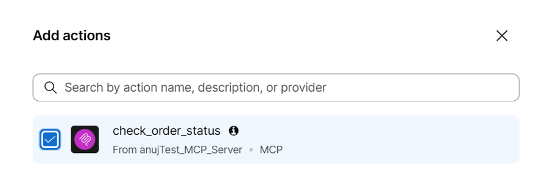{ width="600" }

- Publish the changes.

- Test the MCP connections directly from the Chat by clicking the preview option  and confirm the order status by stating
  **Hi, Can ya let me know the status of Order ID 4**

    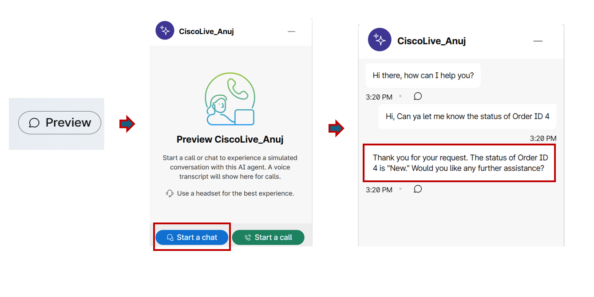{ width="800" }

# Result
- Congratulations! The integration is now live. Customers can check their car order status through the AI agent at any time, and a clear escalation path is in place for interactions that need a human touch. With this foundation in place, Part 2 of this lab introduces AI Quality Management tools to monitor, evaluate, and improve the quality of live agent interactions when customers escalate with a problem.
