# Excercise 2 - AI-Powered Quality Management in Webex Contact Center

## **Objective**

Consider , You are a supervisor managing a small team of 3 to 4 agents in a customer contact center handling customer escalated calls from the AI Agent. Over the past few weeks, you have noticed a pattern where customers are consistently giving low satisfaction scores after their calls, and complaints are starting to escalate up the chain.

You don't have time to manually listen to every call, but you know things need to improve. With access to Webex AI Quality Management, you decide to take action using AI-powered assistant features to get to the bottom of what's happening, find out which agents need support, and put a coaching plan in motion.

Your mission unfolds throu through these two modules.

**Prerequisites**

Your organization must have the required AI Quality Management entitlement.

- Real-time transcription must be enabled for the queue.
- The voice flow used in customer calls must be updated to support real-time transcription for the interactions that need to be analyzed.
- Your organization must have the required AI Quality Management entitlement.

### Module 1: Find the calls through Sentiment Analysis

**The Challenge:** You have no idea which calls are the problem ones. With dozens of interactions completed each day, you can't review them all manually.

**Task:** Leverage WXCC AI QM feature Configure  Sentiment Analysis for the queues so you can find the negative interactions automatically. Once enabled, you filter the Completed Interactions table to show only calls tagged as Negative (score below -45) and look for patterns . This will help as sentiment filter becomes your radar — it lets you zoom in on the calls that matter and you are not guessing. 

#### Step 1: Enable Sentiment Analysis

- Sign in to Control Hub using the URL **https://admin.webex.com** with the administrator credentials provided in the table above.

- Navigate to Services > Contact Center.

    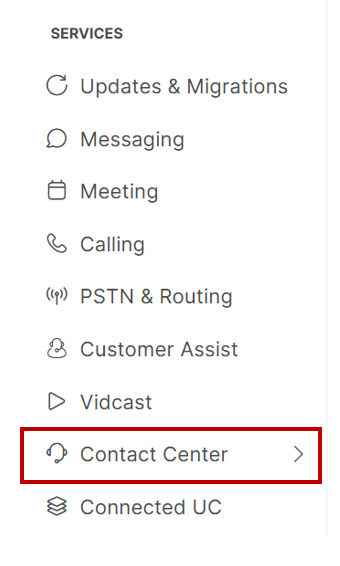{ width="200" }

- Under Desktop Experience, select AI Features from the navigation pane.

    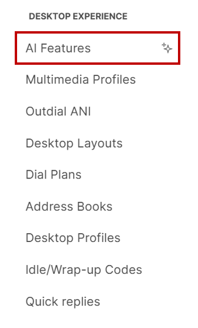{ width="200" }

- Ensure that Sentiment Analysis is turned on under Global Settings. Since we want this setting to apply to all queues, ensure Apply to All Queues is also enabled.

    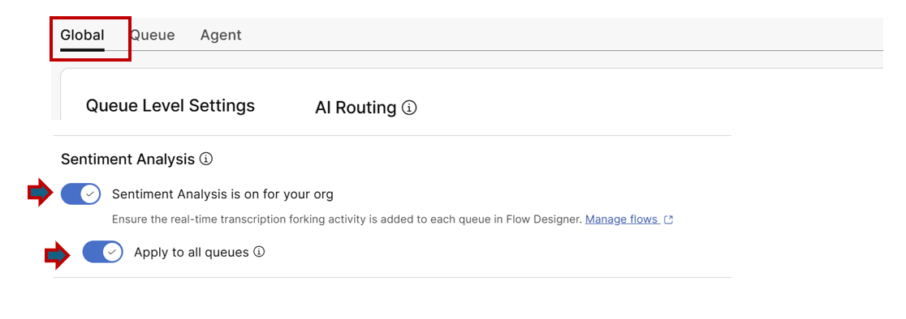{ width="700" }

- To confirm the feature is enabled for your specific queue, go to the Queue Level tab, search for and select queue **CiscoLive_MCPAIAgent_Queue_*Number***, and verify that Sentiment Analysis is enabled.

- On the same queue, confirm that Real-time Transcription is enabled — this is required for the AI engine to analyze interactions and generate sentiment scores.

    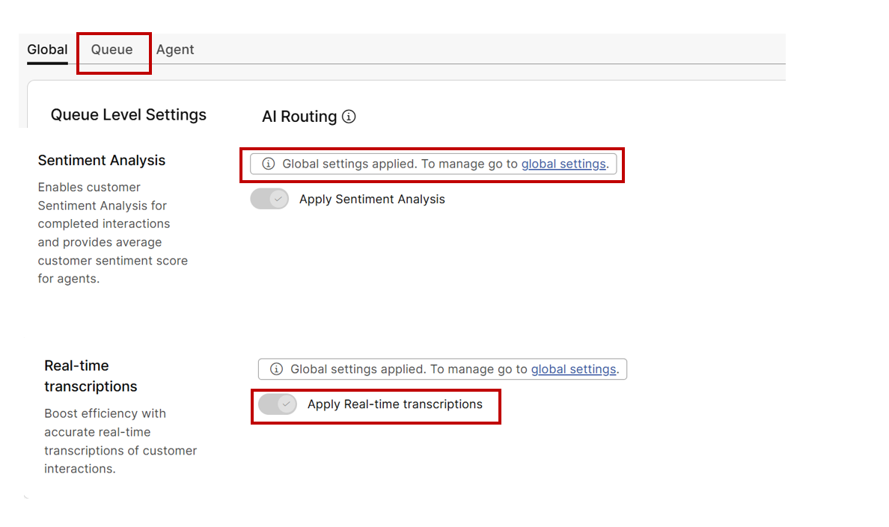{ width="700" }

!!! Note
    As Sentiment Analysis is enabled under Global Settings, Real-time Transcription is also enabled for all queues. As a result, the option will appear enabled but grayed out at the queue level.

- Click Save to apply the changes.

- Now, Lets Configure the Voice Flow for Real-time Transcription

- Navigate to the Flows menu on the left-hand side under the Customer Experience section.

    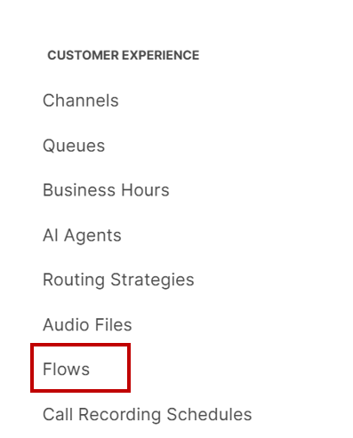{ width="300" }

- Click Manage Flows and search for the flow **CiscoLive_MCPAIAgent_Flow_*Number***.

    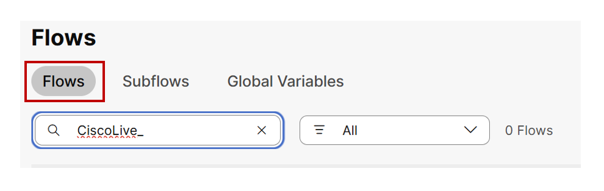{ width="600" }

- Open the flow and click Edit.

    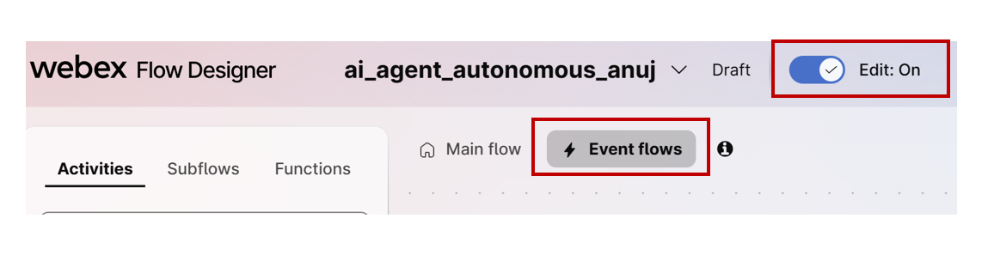{ width="600" }

- On the event flow canvas, add a Start Media Stream activity node directly after the AgentAnswered event and Ensure the activity is connected to the End Flow node.

    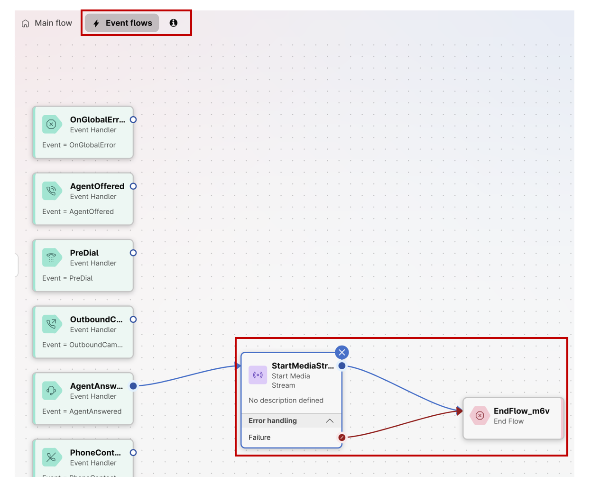{ width="700" }

- Click Validate and then Publish the flow.

    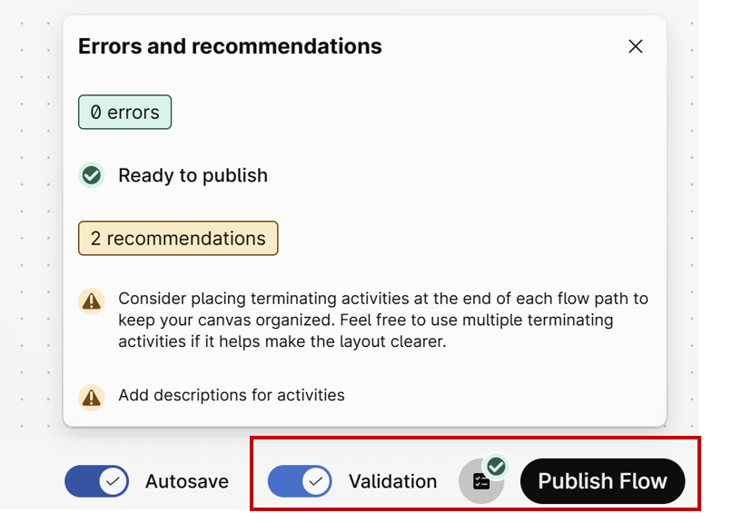{ width="500" }

- This enables real-time transcription for every call routed through this flow.

- To test Real-time Transcription, Log in to the Webex Contact Center Agent Desktop.

- To access it, go to the **Overview** section in Contact Center in control hub, look under Quick Links, and select 'Desktop'

    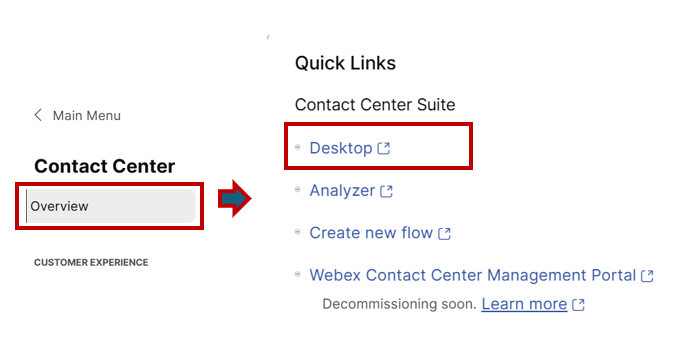{ width="500" }

- Under Interaction Preferance select these options:
    - For the team use **CiscoLive_MCPAIAgent_Team_N** (where 'N' is your lab user number)'.
    - For the phone number, select **Dialed Number**
    - Enter **2032988248** (this is the proctor's number).

- Ensure the agent status is set to avaialable.

    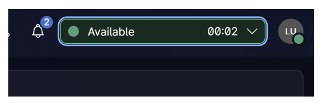{ width="400" }

- Call the channel number (from the steps above), interact with the Webex AI Agent and escalate the call to your agent.

- Accept the call and talk with the proctor. While conversing, observe the conversation being converted into real-time transcripts in the Transcripts gadget

    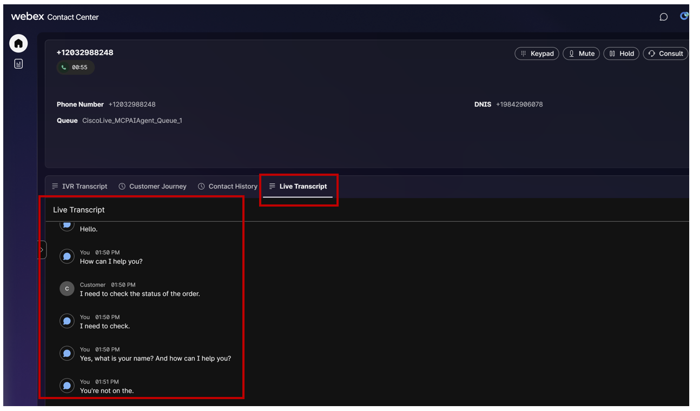{ width="600" }

- Sentiment Analysis focuses on customer utterances during the interaction, with more weight given to what the customer says toward the end of the call. 

- During the conversation, use your utterances to influence the sentiment of the call — either positively or negatively — to see how it affects the sentiment score. 

#### Step 2: View Sentiment Analysis 

- Navigate to Supervisor Desktop using the URL. While using the Chrome browser, open it in Incognito mode
    - **https://desktop.wxcc-us1.cisco.com/**

- Log in with the supervisor credentials; these details should have already been provided by the lab proctor.

- When prompted, select Supervisor as your role, choose the Extension option, enter **1011 or any 4-digit** extension, and click Save and Continue.

    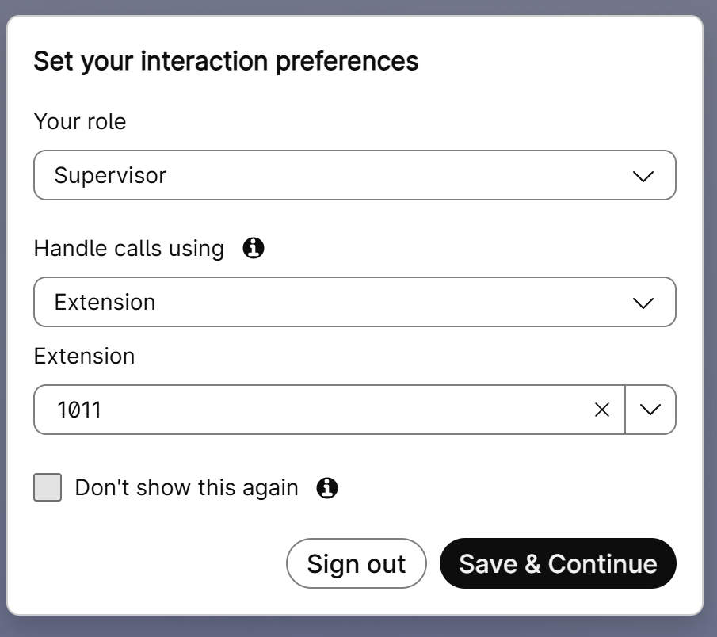{ width="400" }

- In the Completed Interactions table, you can view the calls accepted by agents.

    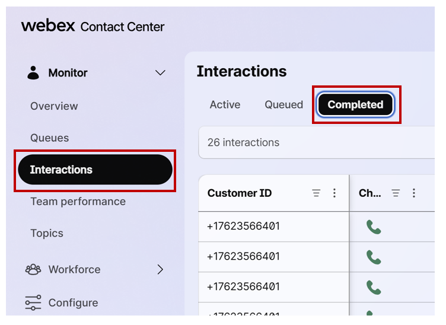{ width="400" }

  !!! Note
    To view other call samples, ensure that the selected date range is from May 1, 2026, onwards to see various call examples.

- If the Customer Sentiment column is missing, click the Settings icon in the table toolbar, search for "Customer Sentiment," and select it to add it to your view.

    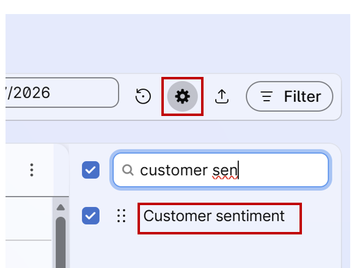{ width="400" }

- You can now see sentiment scores for each completed interaction. 

- Scores range from -100 to +100 and are classified as:
    - **Positive** — score above +46
    - **Neutral** — score between -45 and +45
    - **Negative** — score below -45

- As a supervisor, review the calls with a Negative score to identify frustrated customer interactions and pinpoint where things may have gone wrong.

    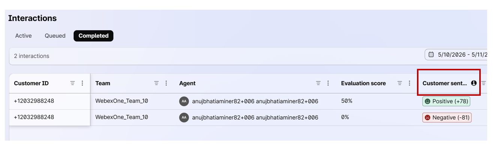{ width="800" }

### Module 2: Automated Evaluations

**The Challenge:** You've identified the frustrated calls, but you need to understand why they went badly.

**Task:** You create an Evaluation Form with sections for Customer Order Evaluation, Professional Conduct and Conclusion, and set up assignment rules to automatically apply it to interactions in your team. You review the AI-generated scores alongside speech analytics signals  turning vague frustration into hard evidence. Now instead of telling an agent that customers seem unhappy, you have specific scores and interaction data to back up the conversation.

#### Step 1: Enable Evaluations and Speech Analytics

- Sign in to Control Hub using the URL **https://admin.webex.com** with the administrator credentials provided in the table above.

- Navigate to Services > Contact Center.

    { width="200" }

- Under Desktop Experience, select AI Features from the navigation pane.

    { width="200" }

- Ensure that **Coaching Insights** & **Evalautions and Speech analytics** is turned on under Global Settings.

    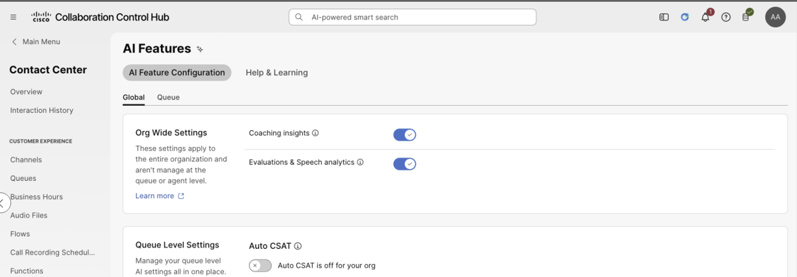{ width="650" }

!!! Note
    This option you will be able to see only in licensed org , In trial org this option is not visible hence not seen here , Screen shot reflects the information. 

#### Step 2: Create an Evaluation Form

- An Evaluation Form defines how interactions are scored. It includes basic details, assignment rules, sections, and questions that can be auto-evaluated.

- Navigate to Supervisor Desktop as performed in Module 1 

- Open Evaluation Form from Configuration Manager in the navigation bar.

    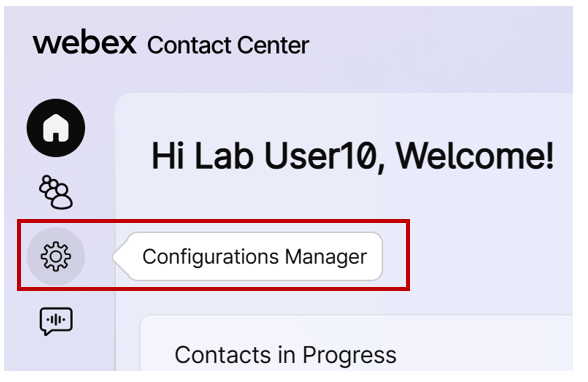{ width="300" }

- Click + Create a Form.

    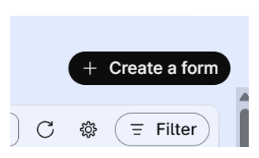{ width=300" }

- Enter a clear name and description for the form.

    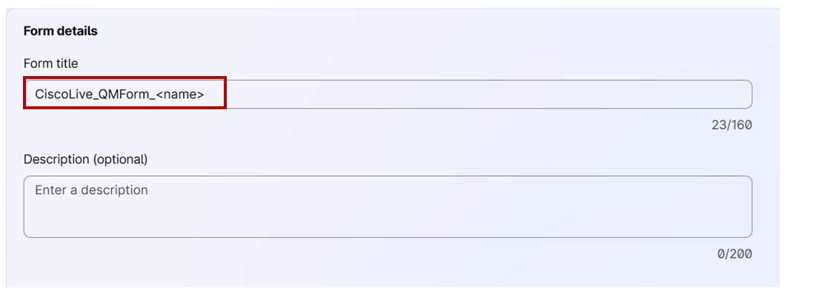{ width=700" }

- Feel free to create your own form with questions of your choice for practise

- For reference, review the form already created — **CiscoLive_AIQM_Anuj**

- This form is designed to help understand why customers are escalating to speak to a live agent after placing a car order. The form is divided into the following sections with their respective questions:

    - **Section 1: Post Car Order Evaluation**
        - Q1. Did the agent identify themselves?
        - Q2. Did the agent confirm the customer's identity before continuing the conversation?
        - Q3. Did the agent ask the customer to clearly explain their issue?

    - **Section 2: Professional Conduct**
        - Q1. Did the agent address the customer by name at least once during the call?
        - Q2. Did the agent consistently display a friendly and constructive tone while assisting the customer?

    - **Section 3: Conclusion**
        - Q1. Did the agent check if the customer had any additional needs before ending the conversation?
     
    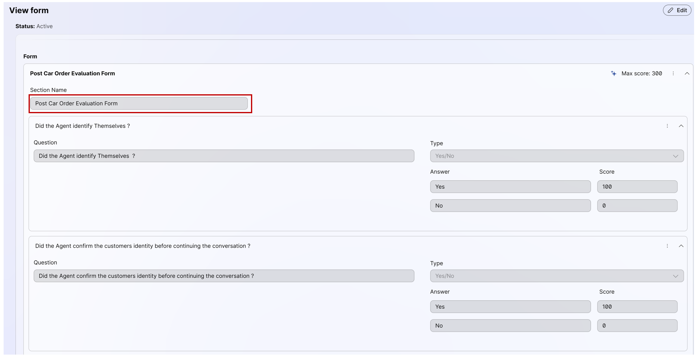{ width=700" }

!!! Note
    All questions in this form are Yes/No type. A score of 100 is assigned for Yes and a score of 0 is assigned for No.

- Once the form is created, define the Assignment Policy.

    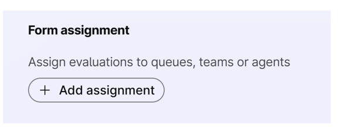{ width=400" }

- You can assign the form by queue, team, agent, or every nth interaction. More than one assignment policy can be applied to target the right set of interactions.

- For this lab, assign the form to your designated team **CiscoLive_MCPAIAgent_Team_Number** and click Publish to activate the form.

    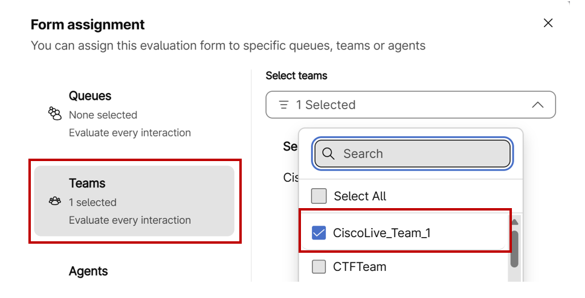{ width=500" }

- Make a couple of test calls, ensure the agent is logged in and available to pick up the calls. 

- Use different customer sentiment scenarios to generate interaction data for the evaluation form to score against.

#### Step 3: Review Evaluation Scores

- Navigate to the Completed Interactions table on the supervisor desktop.

    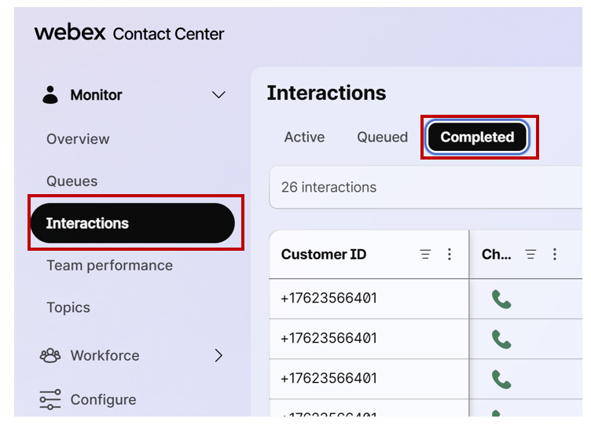{ width=500" }

- You should see the evaluation score displayed along with the customer sentiment scores.

    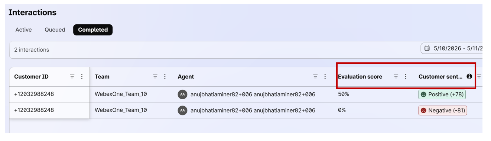{ width=700" }

- If not seen , to display the Evaluation Score column, click the Settings icon in the table toolbar, search for Evaluation Score, and select it from the list of available columns.

    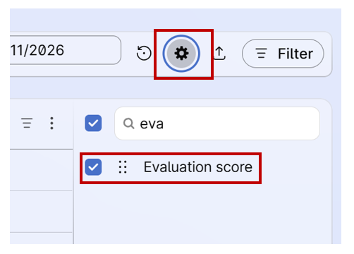{ width=400" }

- Open a completed interaction where evaluation Score is low along with low customer sentiment  by clicking on the View option in Actions

    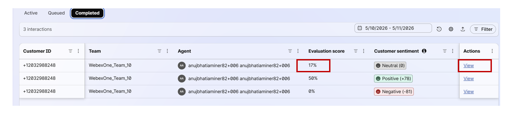{ width=800" }

!!! Note
    Ensure that date range selected is from **1st May 2026** onwards to see various call examples. 

- Go to the Evaluations tab to review the average evaluation score across all forms assigned to that interaction.

    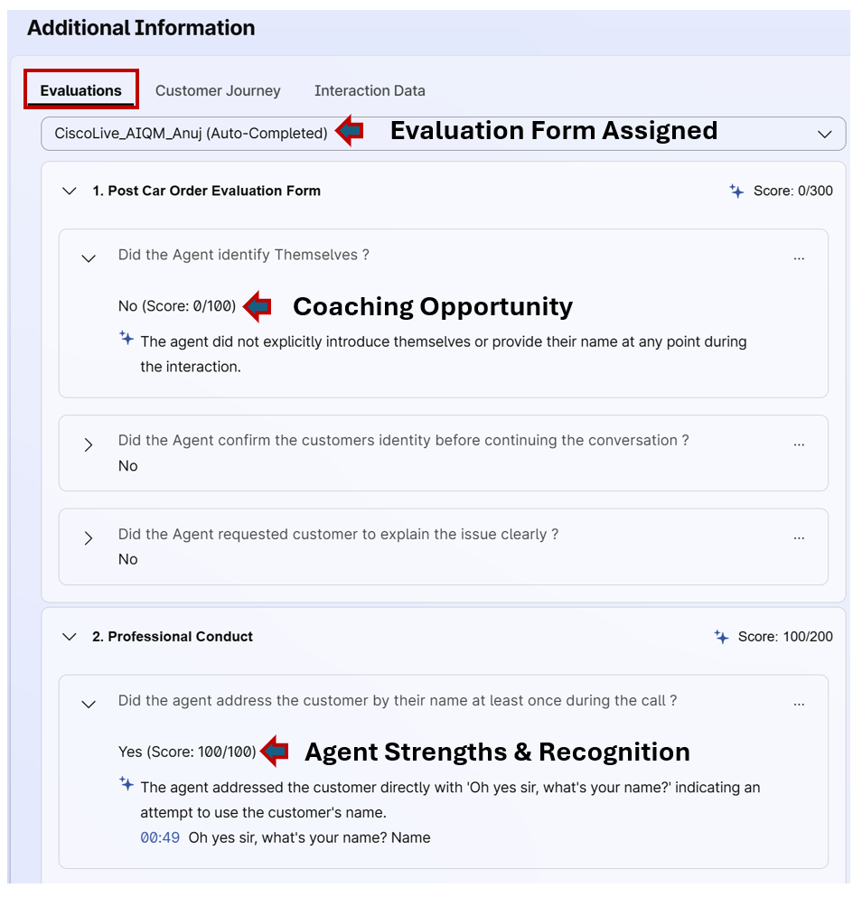{ width=500" }

- Use the interaction recording, transcript, and additional details to validate the scores, and adjust them manually where needed based on the evidence.

    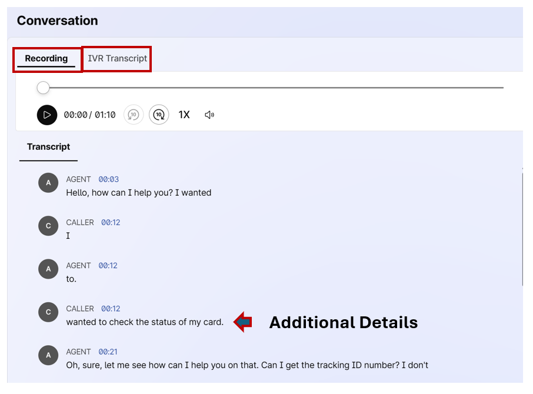{ width=600" }

- All these points can be used as evidence when coaching team members, helping them improve their interactions with customers and ultimately increase customer satisfaction.

# Result

Congratulations! Your Evaluation Form is now live and automatically scoring interactions across your team. You no longer have to rely on gut feeling — you now have AI-generated scores and real interaction data to support every coaching conversation you have with your agents.

