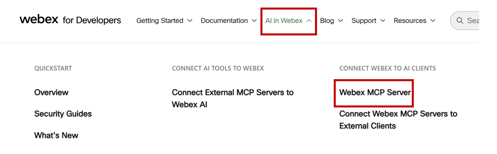
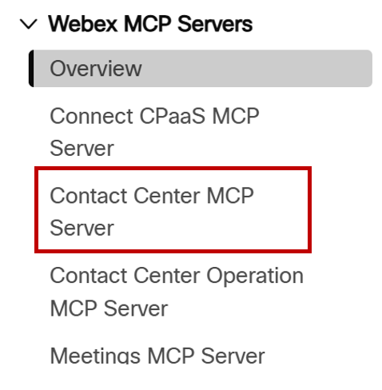
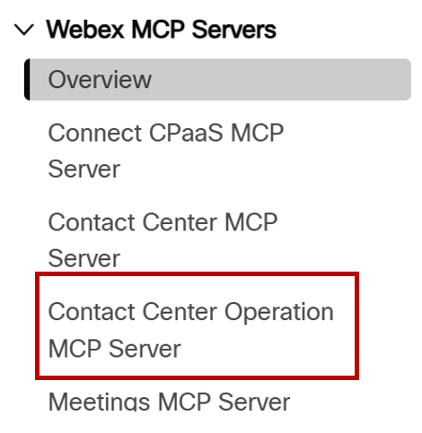
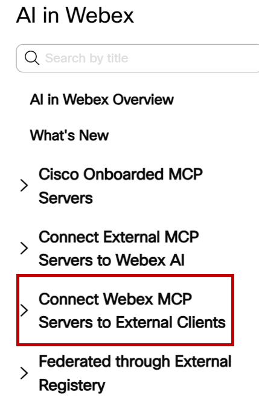
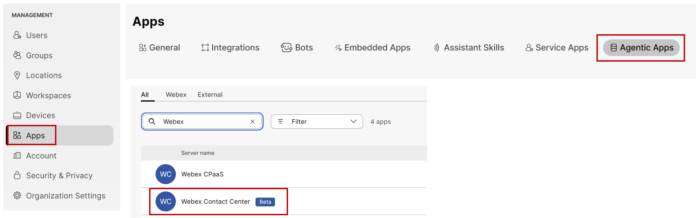
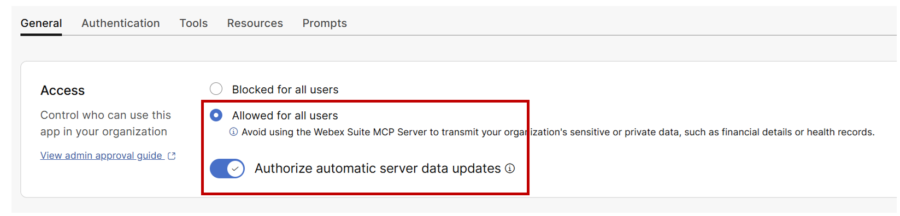
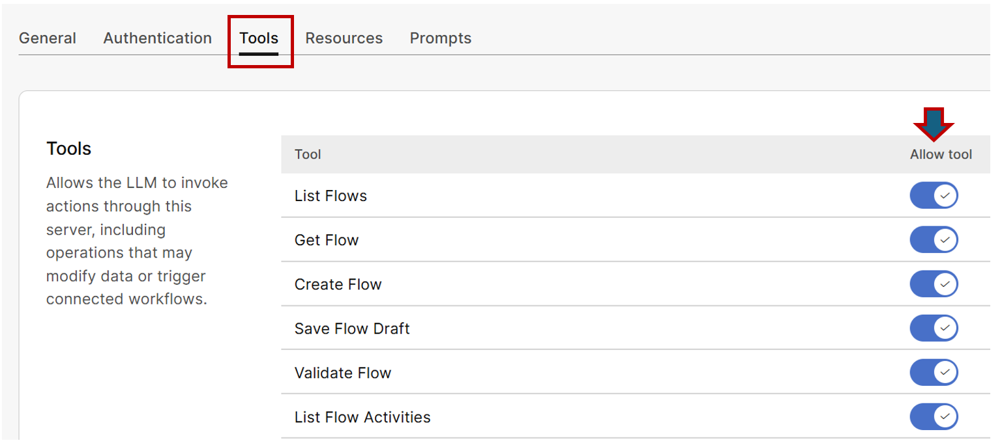

# Task 6 - Connect WxCC to Inhouse CC MCP Servers

Please use the following credentials to connect to Control Hub and configure Webex Contact Center:

| <!-- -->         | <!-- -->         |
| ---------------- | ---------------- |
| `Agent Desktop URL`            | <a href="https://desktop.wxcc-us1.cisco.com" target="_blank">https://desktop.wxcc-us1.cisco.com</a> |
| `Username`       | labuser**ID**@wxccciscolive2024.wbx.ai     _(where **ID** is your assigned pod number (06 through 10); i.e. labuser**07**@wxccciscolive2024.wbx.ai if assigned pod is 7))_       |
| `Password`       | ciscoliveUS24!         |


## **Objective**

In this module, you will step into the role of a Contact Center Solutions Architect and integrate AI developer tooling directly into operational and administrative workflows by completing the following tasks:  

1. Explore the Developer Portal: Review the available Webex Contact Center platform MCP servers—specifically the Contact Center MCP Server (for administrative and flow authoring tasks) and the Contact Center Operation MCP Server (for operational intelligence and telemetry) and learn how these servers connect to various AI clients.  

2. Enable Tools in Control Hub: Integrate your lab organization with the WxCC MCP servers through Control Hub and enable the appropriate tools for AI client execution. 

3. Connect Your AI Client: Connect your AI client to WxCC using Webex Agentic platform credentials through Webex Token Integration (WCIT).  

4. Execute Operations & Troubleshoot: Run natural language read queries across org settings, operational telemetry, and flows. Then, perform a deterministic write operation on a flow draft and resolve real-world access and payload validation errors embedded within the lab environment.


## Section 1: Explore the Developer Portal

- Open your browser and navigate to [developer.webex.com](https://developer.webex.com/).

- Click **Log in** in the top-right corner and authenticate using the provided credentials.

- From the top navigation menu, select **AI in Webex** and opt for  **Webex MCP Servers**

    { width="700" }

- Click **Overview** to learn how Webex MCP servers act as a bridge between AI clients and Webex capabilities.

- In the sidebar under **Webex MCP Servers**, click **Contact Center MCP Server**.

    { width="200" }

- Review the core capabilities:

	* **Purpose:** Handles administrative, day-zero operations, flow authoring (FlowV2/ActivityV2), and webhook subscriptions.
	* **Authentication & Scopes:** Note the required OAuth scopes (`spark:mcp`, `cjp:config_read`, `cjp:config_write`, `cjp:user`, and `spark:people_read`).
	* **Tools List:** Scroll to the **Tools** section to inspect functions like `wxcc-list-flows`, `wxcc-get-flow`, `wxcc-save-flow-draft`, and `wxcc-view-config`.

!!! Note 
	Notice the Server URL that has been costructed , that will ne needed to integrate with the AI client. 

- In the left sidebar, select **Contact Center Operation MCP Server**.

    { width="200" }

-  Review its core capabilities:

	* **Purpose:** Delivers operational intelligence, real-time/historical telemetry, routing analysis, contact timelines, and Virtual Agent transcripts.
	* **Tools Catalog:** Inspect the 25 specialized tools across categories such as:
		* **Configuration:** `wxcc-operations-describe-org`, `wxcc-operations-list-config`
		* **Contacts & Telemetry:** `wxcc-operations-get-contact-timeline`, `wxcc-operations-get-contact-summaries`
		* **AI & Virtual Agents:** `wxcc-operations-get-va-transcript`, `wxcc-operations-get-va-summary`


- Now, lets explore Client Integration Guides

- On MCP server documentation page, locate the **Connect Webex MCP Servers to External Clients** section.

    { width="200" }

- Click **Cursor** from the list of supported AI clients.

- Review the instructions detailing token-based authentication via **Webex Token Integration (WCIT)** and runtime scope elicitation.

## Section 2: Review MCP Integration in Control Hub

As Day 0 setup only needs to be completed once, this shared environment has already been pre-configured by administrators. Follow these steps to inspect and review how the WXCC MCP servers and tool capabilities are authorized in Webex Control Hub

- Open your browser and navigate to [admin.webex.com](https://admin.webex.com).

- Log in using your assigned administrator credentials.

- In the left-hand navigation pane, go to **Apps**.

    { width="700" }

- Select **Agentic Apps** from the sub-menu.

- Locate the pre-configured MCP servers in the dashboard list:
	* **Contact Center MCP Server**
	* **Contact Center Operation MCP Server**

- Click on **Contact Center MCP Server** to open its settings drawer.

- On the **General** tab, verify that the **Access** status is set to **Allowed for all users** for the organization.

    { width="700" }

- Observe that **Authorize automatic server data updates** is enabled to keep server schemas up to date without requiring re-authorization.

- Click the  **Tools** tab within the MCP server panel.

    { width="700" }

- Review the list of enabled tools permitted for AI client execution

- Confirm that flow authoring and configuration tools (e.g., `wxcc-list-flows`, `wxcc-get-flow`, `wxcc-save-flow-draft`) are active.

- Repeat this review for the **Contact Center Operation MCP Server** to confirm its active status.

- Review the list of enabled tools permitted for AI client execution and confirm that reporting and telemetry tools (e.g., `wxcc-operations-describe-org`, `wxcc-operations-list-config`, `wxcc-operations-generate-report`) are active.

- Click **Review** on any tool name to inspect its description, input parameters, and authorized schema definitions.

-  Finally, confirm organization readiness by verifying that both MCP servers display an active Allowed status in Agentic Apps.

## Section 3: Connect Your AI Client (Cursor)

Follow these step-by-step instructions to generate a Webex Client Identity Token (WCIT) and integrate the Cursor AI Client with both Webex Contact Center MCP servers using the One-Click Web Install option.

- Open your browser and navigate to the Cursor integration page on the Webex Developer Portal: [Connect Webex MCP Servers to External Clients (Cursor)](https://developer.webex.com/mcp/docs/webex-agentic-mcp-servers-cursor).

- Verify that you are logged in with your assigned lab account. Under the **Generate WCIT Token** section, click **Generate Token**.

- On the **Manage Webex Agentic MCP App token** page, click **Generate Now**.

- Enter a descriptive token name (e.g., `Cursor-WxCC-Lab-Token_<your-name>`).

- Under the MCP Server dropdown, select **Webex Contact Center**.

- Click **Generate Token**.

- Copy the generated token string immediately and save it in a text editor for easy access.

- **Note on Scopes:** WCIT tokens are issued with the baseline `spark:mcp` scope to establish the initial MCP server connection. When a specific tool call requires elevated permissions (such as `cjp:config_read` or `cjp:user`), Cursor automatically requests them at runtime via MCP scope elicitation.

- Now, lets Integrate the Contact Center MCP Server in Cursor

- Return to the Cursor integration page on the Webex Developer Portal (`Documentation > AI in Webex > Connect Webex MCP Servers to External Clients > Cursor`).

- In the **Install** section, enter the following details:
	* **Server Name:** Provide a unique name (e.g., `WxCC_MCP_Server_<your-name>`).
	* **Server URL:** Go to the **Contact Center MCP Server** documentation section to copy the official endpoint URL:
`		[https://agentic-server-platform.produs1.ciscoccservice.com/mcp/webex-contactcenter](https://agentic-server-platform.produs1.ciscoccservice.com/mcp/webex-contactcenter)`
	* **WCIT Token:** Paste the WCIT token string you generated in Step 1.

- Under **Click to install for:**, click **Cursor** to automatically register the server in your Cursor application.

- This should establish Contact Center MCP Server Connection to Cusrsor client to verfiy 

- In **Cursor** open a new Chat window.

- Click the **+** icon next to the chat prompt and select **MCP Server**.

- Locate `WxCC_MCP_Server_<your-name>` in the server list.

- Confirm that a green active status indicator appears next to the server, verifying that its tools are ready for execution.

- Follow the same steps to Integrate the Contact Center Operation MCP Server in Cursor

- Return to the Cursor integration page on the Webex Developer Portal.

- In the **Install** section, enter the details for the second server (reusing the same WCIT token):
	* **Server Name:** Provide a unique name (e.g., `WxCC_MCP_Server_Operations_<your-name>`).
	* **Server URL:** Go to the **Contact Center Operation MCP Server** documentation section and copy its endpoint URL:
`		[https://developer.webex.com/mcp/docs/contact-center-operation-mcp-server](https://developer.webex.com/mcp/docs/contact-center-operation-mcp-server)`
	* **WCIT Token:** Paste your saved WCIT token.

- Under **Click to install for:**, click **Cursor** to complete registration.

- To Verify, return to Cursor, click the **+** icon in a new Chat window, and select **MCP Server**.

- Locate `WxCC_MCP_Server_Operations_<your-name>` in the list.

- Confirm that the status indicator displays a green active state, indicating the operations server is connected and ready for query execution.

## Section 4: Execute Operations 

In this final section, you will run natural language queries across the MCP servers and explore how read and write operations work in an AI client.

- Open a new Chat window in **Cursor** to analyze operational telemetry. 

- Select your `WxCC_MCP_Server_Operations_<your-name>` model context or target the server directly using `@`.

- Enter the following prompt:
> *"Analyze the contact center reports for the past 24 hours. List the top active entry points and queues by total call volume, identify which flow is handling the highest number of calls, and summarize its average handle time."*
> 

- Behind the Scenes , cursor invokes operational tools like `wxcc-operations-generate-report` or `wxcc-operations-describe-org` to retrieve call session metrics and routing details.

- Review the summary generated by Cursor and make a note of the **Flow Name** or **Flow ID** associated with the highest call volume.

- Lets inspect the flow details by entering the following prompt to review the details of the flow directly within the AI Chat window:
> *"Fetch the flow details and draft schema for the flow identified in the previous step using its Flow ID."*
> 

- Now, lets explore administrative Write operations scenario 

- For it switch your prompt context in Cursor to `WxCC_MCP_Server_<your-name>`.

-  Retrieve the current organization configuration by entering:
> *"Fetch the business hours configured for this org."*
> 

- Behind the Scene, cursor executes `wxcc-view-config` to retrieve the active business hours structure.

- Review the contact center schedule. During your review, you realize that Friday's working hours need to be updated.

- Prompt Cursor to initiate a write operation with the following instruction
> *"I need to update our Business Hours schedule to extend our support availability by 1 hour on Fridays."*
> 


- Review the Proposed Change, cursor will invoke `wxcc-admin-config` and present a structured JSON payload detailing the proposed change:

```json
{
  "body": {
    "name": "BusinessHourOne",
    "description": "",
    "timezone": "America/New_York",
    "workingHours": [
      {
        "name": "Weekday",
        "days": [ "MON", "TUE", "WED", "THU" ],
        "startTime": "09:00",
        "endTime": "17:00"
      },
      {
        "name": "Friday",
        "days": [ "FRI" ],
        "startTime": "09:00",
        "endTime": "18:00"
      }
    ]
  },
  "id": "fdd5dab0-643c-4ded-a28f-cde4d720a48d",
  "operation": "update",
  "orgId": "f0f2a0a3-218e-4152-841e-09a18b9b17b0",
  "resource": "business-hours"
}
> 
> 

!!! Note
	**Do not confirm or execute this update.** This step is designed to demonstrate how AI clients handle write operations—requiring explicit human confirmation before committing any administrative changes to the live tenant.

## Result
Congratulations! You have successfully completed this lab. Throughout this module, you learned how to navigate Webex Contact Center MCP servers in the Developer Portal, review organizational and tool authorizations in Control Hub, connect the Cursor AI client using WCIT token authentication, and use natural language to query operational telemetry, inspect routing flows, and execute safe administrative write requests.
